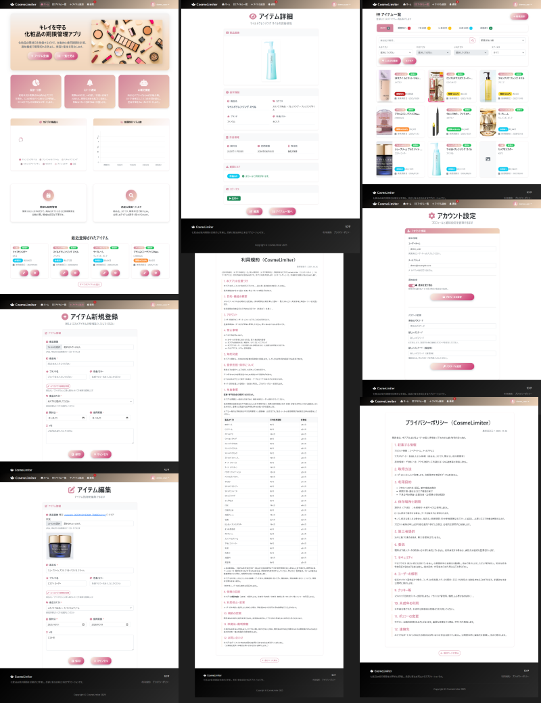
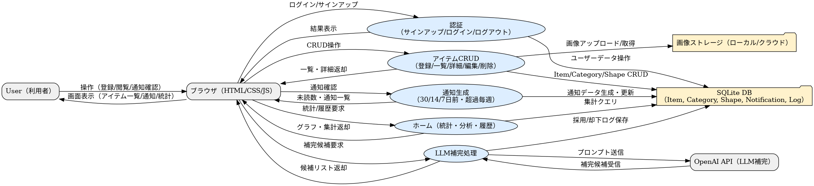
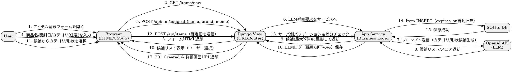
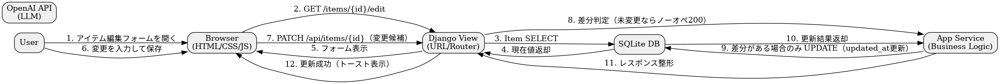
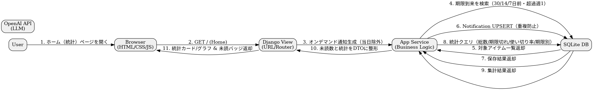

# 💄 CosmeLimiter（コスメリミッター）

**キレイを守る、化粧品の期限管理アプリ。**  
化粧品の使用期限を自動で計算し、適切な時期に通知するWebアプリケーションです。

🧠 **OpenAIのLLM（gpt-5-nano）** が商品名・ブランド名からカテゴリを自動推定し、登録作業をスムーズにサポート。  
開封日を入力するだけで使用期限を自動計算しますので、もう使用期限を覚える必要はありません。

本アプリは、自ら企画・開発したオリジナル作品です。  


---

## 👩‍💻 開発背景

化粧品は開封した瞬間から劣化が始まり、その使用期限は意外と短いもの。  
品質が落ちると美容効果が弱まり、時には肌トラブルにつながることもあります。

雑誌や専門家は「開封から◯ヶ月以内に使い切るべき」と警鐘を鳴らしていますが、  
忙しい日々の中で“いつ開けたか”を覚えておくのは難しいと思います。  

だからこそ私は、  
> 「期限を覚える負担をなくし、安心して最後まで使い切れる仕組みを届けたい」  

という想いでこのアプリを作りました。  
誰もが衛生的に、安心して、コスメを最後まで気持ちよく使えるように。  
この一つのアプリで、日々の美容を少しでも支えたいと思っています。

---

## 🧩 解決する課題

- 使用状況や期限切れを自動で可視化し、管理の手間を削減  
- 期限切れコスメ使用による肌トラブルを防止  
- 使用ペース・ストックを管理し、ムダ買い・使い忘れを防止  
- データ分析で、自分の美容習慣を客観的に把握  

---

## 🔥 工夫したポイント

- 柔軟に拡張できるカテゴリ構造<br>
    コスメのカテゴリは「大 → 中 → 小」のように階層が深く、後から新しいカテゴリが追加されることも少なくありません。<br>
    そこで Django の自己参照モデルを用いた Taxon ツリー構造を採用し、階層を自由に増やせる仕組みを構築しました。<br>
    この設計により、カテゴリを追加してもアプリ全体の整合性が崩れず、将来の拡張にも柔軟に対応できるようになっています。

-  LLM が正確にカテゴリを選べるように工夫<br>
    AI にカテゴリを推定させる際には、ただ商品名を渡して答えを返させるのではなく、精度が最大限に高まるように入力情報の工夫をしました。<br> 
    具体的には、LLM に渡す候補を「葉ノード（最下層カテゴリー）」のみに絞り込み、さらに「大カテゴリ > 中カテゴリ > 小カテゴリ」といった<br>
    パンくず形式でカテゴリーの文脈情報を付与しています。また、商品名に応じて候補を事前フィルタリングし、AI が判断しやすい環境を整えました。<br>
    万が一推定に失敗した場合でも、フォールバック処理によって安全に動作するよう設計しており、これらの工夫によって推定の安定性と精度が大きく向上しています。

---

## 💡 ユーザー体験ストーリー

1. 商品名とブランド名を登録すると、AIがカテゴリを自動推定  
2. 開封日を登録すると、カテゴリと開封日から使用期限を自動計算  
3. 期限の30日・14日・7日前・期限切後に通知  
4. 商品名・ブランド・状態で検索・絞り込み可能  
5. 使用履歴をグラフ化して、自分の消費傾向を見える化  


---

## ⚙️ 機能一覧

### 🌟 主要機能
- アイテム登録（商品名・ブランド・カテゴリ・画像）  
- 自動期限計算（カテゴリ別の平均使用期限をもとに算出）  
- 通知システム（30日・14日・7日前・期限切れを自動通知）  
- AIカテゴリ補完（OpenAI APIによるカテゴリ推定）  
- 使用状況の可視化（グラフによるリスク分析）  
- 画像アップロード機能  
- DjangoカスタムEmailBackendによるログイン認証  

### 💅 補助機能
- 絞り込み検索（カテゴリ／状態／ブランド）  
- メモ機能  
- レスポンシブデザイン（モバイル対応）  
- 統計ダッシュボード  

---

## 🧠 使用技術

### 💾 バックエンド
- 言語：Python 3.13+  
- フレームワーク：Django 5.2.4  
- データベース：SQLite 
- 認証：Django EmailBackend  
- AI連携：OpenAI API（gpt-5-nano）  
- 実装：`beauty/llm.py` にてクライアント構築  

### 🎨 フロントエンド
- HTML / CSS / JavaScript  
- フレームワーク：Bootstrap 5.2.3  
- グラフ描画：Chart.js  
- アイコン：Font Awesome 6  

### 🧩 その他
- 画像処理：Pillow  
- 環境変数管理：python-dotenv  
- タイムゾーン管理：zoneinfo
  
---

## 🧭 開発環境セットアップ

```bash
git clone https://github.com/Natsumi-lab/cosme_expiry.git
cd cosme_expiry
python -m venv venv
venv\Scripts\activate    # macOS/Linux: source venv/bin/activate
pip install -r requirements.txt
python manage.py migrate
python init_taxons.py
python manage.py runserver
```

## 🌐 アクセス：
https://natsumich.pythonanywhere.com/


## 🔑 デモアカウント
```bash
メールアドレス: demo@example.com
パスワード: demo_user123
```
---
<p align="left">
  
</p>

<p align="left">
  
</p>

<p align="left">
  
</p>

<p align="left">
  
</p>

<p align="left">
  
</p>

---

## ✨ 開発者メッセージ

ここまでご覧いただきありがとうございます。  
未経験からエンジニア転職を目指し、**「AI × UX × 実用性」** をテーマに設計から実装までを個人で行いました。

AIを“使う”だけでなく、ユーザー体験を自然に支える仕組みとして組み込むことを意識しました。  
日々使うコスメという身近な題材を通じて、**「生活に溶け込むAI」** を形にしたいという想いを込めています。

ユーザーが抱える **“ちょっとした不便”を確実に解消し、日常をもっと快適にしたい。**
その想いが、私がプロダクトを作り続ける理由です。

これからもAIの力を取り入れながら、
「使ってよかった」と思える体験を生み出すアプリを開発し続けます。  
小さな課題にも丁寧に向き合い、誰かの生活を前向きに変えられるプロダクトを届けたいと考えています。
