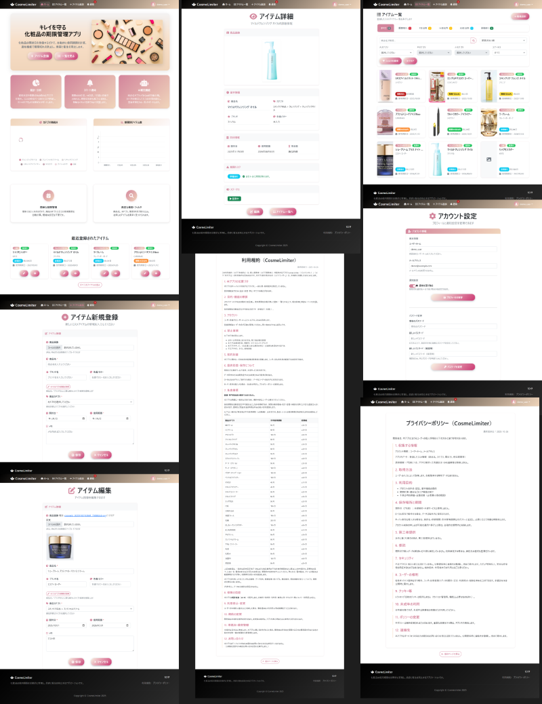
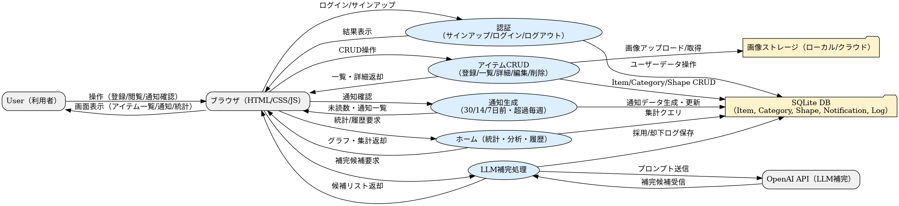
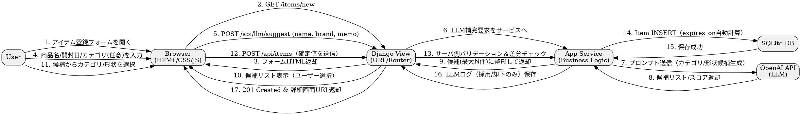
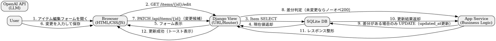
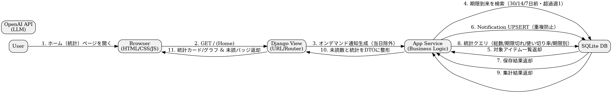

# 💄 CosmeLimiter（コスメリミッター）

Python / Django / Bootstrap / SQLite / OpenAI API を使用した  
化粧品の使用期限を管理するWebアプリです。

化粧品は開封すると劣化が始まるため、
開封日から使用期限を自動計算し、期限が近づくと通知します。  

またOpenAIのLLMを導入し、商品名とブランド名からAIがカテゴリを推定することで、
登録作業を簡単にできるようにしました。

---

## 🌱 アプリ概要
CosmeLimiter は、化粧品の使用期限を「記録 → 通知 → 可視化」するためのアプリです。

- 開封日から使用期限を自動計算
- 期限が近づくと通知
- 使用状況をグラフで確認
- AIがカテゴリを推定して登録を補助  

化粧品を安全に使い切るための管理をサポートします。

---

## 💡 解決する課題

- 使用状況や期限切れを自動で可視化し、管理の手間を削減  
- 期限切れコスメ使用による肌トラブルを防止  
- 使用ペース・ストックを管理し、ムダ買い・使い忘れを防止  
- データ分析で、自分の美容習慣を客観的に把握  

---

## 🚀 デモ


### デプロイURL：
https://natsumich.pythonanywhere.com/

### デモアカウント：
メールアドレス: demo@example.com  
パスワード: demo_user123

---

## 🧩 主な機能

<p align="left">
  
</p>
 
### 主要機能
- アイテム登録（商品名・ブランド・カテゴリ・画像）  
- 開封日から使用期限を自動計算  
- 期限通知（30日・14日・7日前・期限切れ）  
- AIカテゴリ補完
- 使用状況のグラフ表示
- 画像アップロード機能  

### 補助機能
- 絞り込み検索（カテゴリ／状態／ブランド）  
- メモ機能  
- Bootstrapによるレスポンシブデザイン（モバイル対応）

---

## 🛠️ 技術スタック  

### バックエンド
- 言語：Python 3.13+  
- フレームワーク：Django 5.2.4  
- データベース：SQLite 
- 認証：Django EmailBackend  
- AI連携：OpenAI API（gpt-5-nano）  

### フロントエンド
- HTML
- CSS
- JavaScript  
- Bootstrap

### ライブラリ
- グラフ描画：Chart.js 
- 画像処理：Pillow  
- 環境変数管理：python-dotenv  

---

## 💪🏻 工夫したポイント

**1, 柔軟に拡張できるカテゴリ構造**  
  コスメのカテゴリは  
    スキンケア  
      → 化粧水  
      → 高保湿化粧水  
のように階層が深くなることがあります。  

そのため、カテゴリを親子関係で管理できるTaxonツリー構造のテーブル設計にしました。  
これにより、新しいカテゴリが増えても柔軟に対応できるようにしています。

**2, AIカテゴリ推定の精度向上**  
商品名からカテゴリを推定する際、AIが判断しやすいように工夫しました。  
具体的には  
- AIに渡すカテゴリ候補を最下層カテゴリだけに限定
- 「大カテゴリ > 中カテゴリ > 小カテゴリ」のパンくず形式で情報を渡す  
- 商品名から候補カテゴリを事前に絞り込み  

これにより、AIの推定精度が安定するようにしています。  
また、AI推定がうまくいかない場合でも手動でカテゴリを選択できるようにしています。

**3, 期限通知システム**  
使用期限が近づいたコスメをユーザーに知らせるため、  
30日・14日・7日前と期限切れの通知を生成する仕組みを実装しています。  
通知はコマンド処理で定期生成され、通知一覧画面から確認できるようにしています。

---
## 📁 プロジェクト構成  
```
CosmeLimiter/
├── manage.py # Django管理コマンド
├── requirements.txt # Python依存パッケージ
├── README.md # プロジェクト説明

├── cosme_expiry_app/ # Djangoプロジェクト設定
│ ├── settings.py # Django設定
│ ├── urls.py # ルートURL設定
│ ├── wsgi.py # WSGI設定
│ └── asgi.py # ASGI設定

├── beauty/ # メインアプリ
│ ├── models.py # データモデル（Item / Taxon / Notification）
│ ├── views.py # ビュー処理
│ ├── urls.py # URLルーティング
│ ├── forms.py # フォーム定義
│ ├── admin.py # 管理画面設定
│ ├── backends.py # メール認証バックエンド
│ ├── llm.py # OpenAI API連携
│ │
│ ├── management/commands/
│ │ └── generate_notifications.py # 通知生成コマンド
│ │
│ ├── templates/ # HTMLテンプレート
│ └── static/ # 静的ファイル

├── media/ # ユーザーアップロード画像

└── assets/images/ # README用画像
```
---

## 🏗️ アーキテクチャ

このアプリはDjangoの基本構成に沿って実装しています。

- Model  
コスメ・カテゴリ・通知などのデータを管理

- View  
登録処理、検索処理、通知処理などのロジック

- Template  
Bootstrap を使った画面表示

AIによるカテゴリ推定処理はbeauty/llm.pyに分離して実装しています。

---
## 🗺️ システム設計

<p align="left">
  
</p>

<p align="left">
  
</p>

<p align="left">
  
</p>

<p align="left">
  
</p>

---

## 👩‍💻 開発背景  

化粧品は開封してから使い切るまでの期間が短く、  
期限が過ぎたまま使ってしまうことも少なくありません。  

私自身も  
- いつ開封したか覚えていない
- 期限が分からない
- 使い切れずに捨ててしまう
という経験がありました。

そこで「化粧品の期限を簡単に管理できるアプリがあれば便利ではないか」  
と思い、このアプリを作りました。

---

## 🧭 開発環境

```bash
git clone https://github.com/Natsumi-lab/cosme_expiry.git
cd cosme_expiry

python -m venv venv
venv\Scripts\activate    # macOS/Linux: source venv/bin/activate

pip install -r requirements.txt

python manage.py migrate
python init_taxons.py

python manage.py runserver
```

---
## 📌 今後の改善  

- Django TestCaseを用いたテストコードの追加
- Dockerを用いた開発環境の構築
- 通知スケジュール処理の自動化（cronなど）
